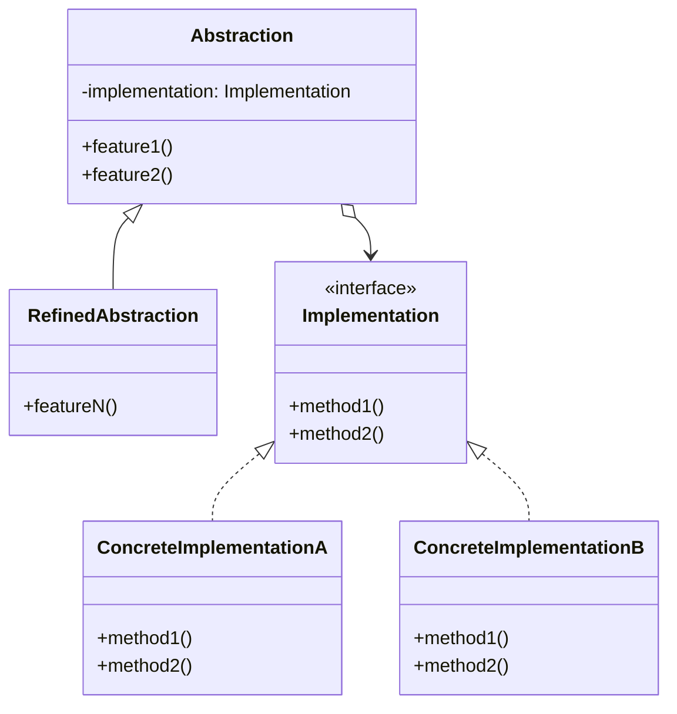

# Bridge Design Pattern

The **Bridge** pattern is a structural design pattern that lets you split a large class or a set of closely related classes into two separate hierarchies—abstraction and implementation—which can be developed independently of each other.

## 🎯 Purpose

Imagine you have a geometric `Shape` class with a pair of subclasses: `Circle` and `Square`. You want to extend this class hierarchy to incorporate colors, so you plan to create `Red` and `Blue` shape subclasses. However, since you already have two subclasses, you'll need to create four class combinations such as `BlueCircle` and `RedSquare`.

Adding new shape types and colors to the hierarchy will grow it exponentially. For example, to add a triangle shape you'd need to introduce two subclasses, one for each color. And after that, adding a new color would require creating three subclasses, one for each shape type. The further we go, the worse it becomes.

This problem occurs because we're trying to extend the shape classes in two independent dimensions: by form and by color. That's a very common issue with class inheritance.

The Bridge pattern solves this by switching from inheritance to composition. You extract one of the dimensions into a separate class hierarchy, so that the original classes will reference an object of the new hierarchy, instead of having all of its state and behaviors within one class.

## 🏗️ Structure and Mechanics

1. **Abstraction**: Provides high-level control logic. It relies on the implementation object to do the actual low-level work.
2. **Implementation**: Declares the interface that's common for all concrete implementations. The abstraction can only communicate with an implementation object via methods that are declared here.
3. **Refined Abstraction**: Provides variants of control logic. Like their parent, they work with different implementations via the general implementation interface.
4. **Concrete Implementations**: Contain platform-specific code.

## 📝 Practice Exercise

In the `com.best.practices.structural.bridge.problem` package, you'll find a set of classes for devices and remote controls. The problem is that the device and the remote control are tightly coupled into a single class hierarchy (`BasicTvRemote`, `AdvancedTvRemote`, `BasicRadioRemote`, `AdvancedRadioRemote`). 

If you want to add a `SmartRemote` or a `DVDPlayer`, the number of classes will grow exponentially.

### Your task (`refactor` package):
1. **Extract the Implementation dimension**: Create a `Device` interface with methods like `isEnabled()`, `enable()`, `disable()`, `getVolume()`, `setVolume(int)`.
2. **Create Concrete Implementations**: Create `Tv` and `Radio` implementing the `Device` interface.
3. **Modify the Abstraction dimension**: Change `RemoteControl` to hold a reference to a `Device` object (via constructor). It should use the device's methods to perform the actions.
4. **Create the Refined Abstractions**: `BasicRemote` and `AdvancedRemote` (which adds a `mute()` method) extending `RemoteControl`.
5. **Update Client**: Update `SmartHomeApp` to compose Remotes and Devices at runtime (e.g., `new BasicRemote(new Tv())`). Once refactored, you can safely delete the old tightly-coupled classes.

## ✅ Advantages

* You can create platform-independent classes and apps.
* The client code works with high-level abstractions. It isn't exposed to the platform details.
* **Open/Closed Principle:** You can introduce new abstractions and implementations independently from each other.
* **Single Responsibility Principle:** You can focus on high-level logic in the abstraction and on platform details in the implementation.

## ❌ Disadvantages

* You might make the code more complicated by applying the pattern to a highly cohesive class.
