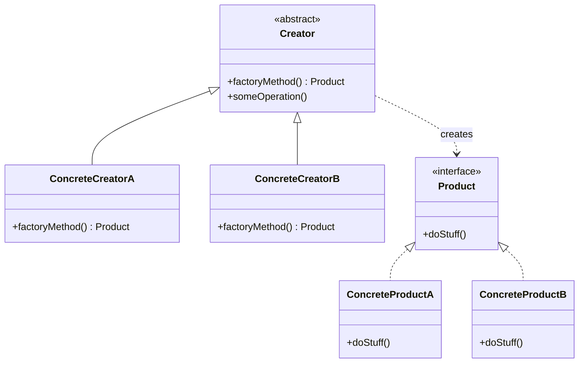

# Factory Method Design Pattern

## Intent
Factory Method is a creational design pattern that provides an interface for creating objects in a superclass, but allows subclasses to alter the type of objects that will be created.

## Structure

## Pros and Cons

### Pros
* **Loose Coupling:** Avoids tight coupling between the creator and the concrete products.
* **Single Responsibility Principle:** You can move the product creation code into one place in the program, making the code easier to support.
* **Open/Closed Principle:** You can introduce new types of products into the program without breaking existing client code.

### Cons
* **Complexity:** The code may become more complicated since you need to introduce a lot of new subclasses to implement the pattern. The best case scenario is when you are introducing the pattern into an existing hierarchy of creator classes.

## Real-World Examples
* **UI Frameworks:** A cross-platform UI framework might have a `Dialog` base class with a `createButton()` factory method. The `WindowsDialog` would return a `WindowsButton` while `WebDialog` returns a `HTMLButton`.
* **Logistics and Delivery Applications:** As modeled in the exercise, a `Logistics` base app class can have a `createTransport()` factory method, and concrete sub-classes like `RoadLogistics` and `SeaLogistics` specify the creation of `Truck` or `Ship` objects.
* **Java Libraries:** `java.util.Calendar.getInstance()`, `java.nio.charset.Charset.forName()`, `java.sql.DriverManager.getConnection()`.
