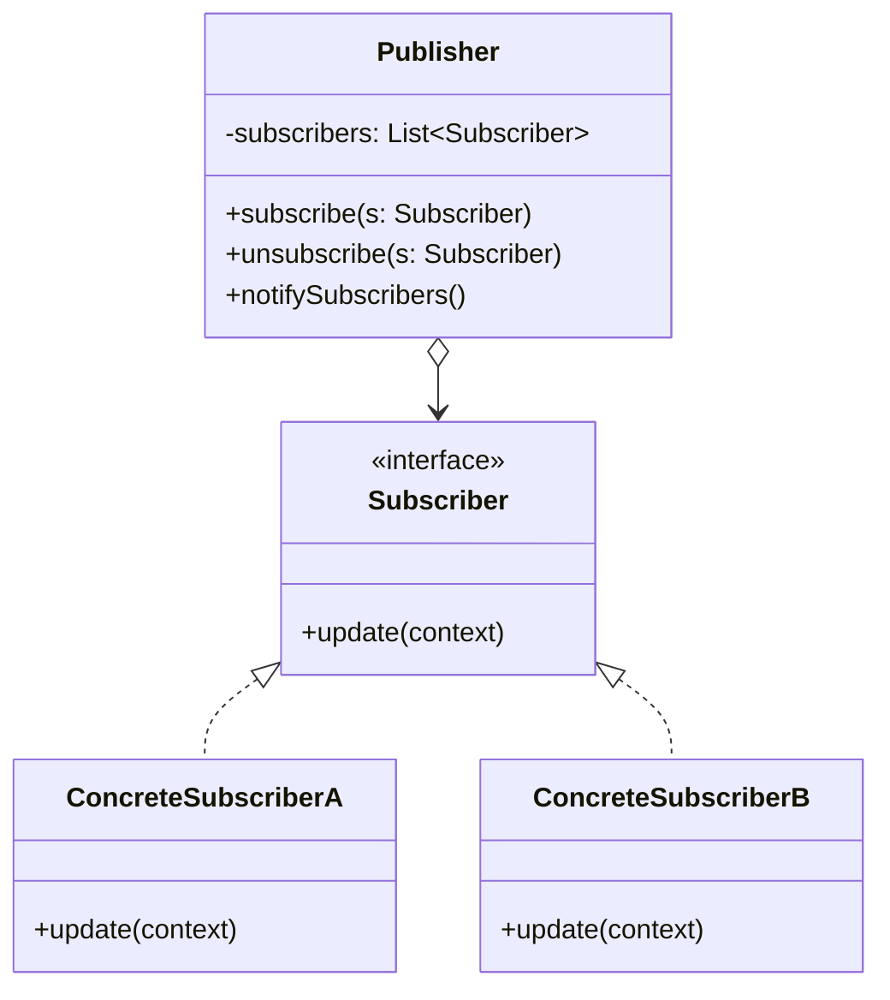

# Observer Design Pattern

The **Observer** is a behavioral design pattern that lets you define a subscription mechanism to notify multiple objects about any events that happen to the object they're observing.

## 🎯 Purpose

Imagine that you have two types of objects: a `Customer` and a `Store`. The customer is very interested in a particular brand of product (say, a new model of an iPhone) which should become available in the store very soon. 

The customer could visit the store every day and check product availability. But while the product is still on the way, most of these trips would be pointless. On the other hand, the store could send tons of emails to all customers each time a new product arrives. This would save customers from endless trips to the store, but at the same time, it'd upset other customers who aren't interested in new products.

The Observer pattern suggests that you add a subscription mechanism to the publisher class so individual objects can subscribe to or unsubscribe from a stream of events coming from that publisher. 

## 🏗️ Structure and Mechanics

1. **Publisher (Subject)**: Issues events of interest to other objects. These events occur when the publisher changes its state or executes some behaviors. Publishers contain a subscription infrastructure that lets new subscribers join and current subscribers leave the list.
2. **Subscriber (Observer)**: The interface that declares the notification interface. In most cases, it consists of a single `update` method.
3. **Concrete Subscribers**: Perform some actions in response to notifications issued by the publisher. All of these classes must implement the same interface so the publisher isn't coupled to concrete classes.

## 📝 Practice Exercise

In the `problem` package, we have a `Store` class that directly instantiates and calls an `EmailService` and a `MobileAppService` whenever a new product is added. This tight coupling means that if we want to add a new notification method (like SMS), we have to modify the `Store` class, violating the Open-Closed Principle.

### Your task (`refactor` package):
1. **Create the Subscriber Interface**: Define an `EventListener` (or `Subscriber`) interface with a method like `update(String productName)`.
2. **Implement Concrete Subscribers**: Modify `EmailService` and `MobileAppService` to implement this interface.
3. **Create the Subscription Mechanism**: Inside the `Store`, manage a list of subscribers. Provide methods to `subscribe()` and `unsubscribe()` listeners.
4. **Notify Subscribers**: When a new product is added, loop through the list of subscribers and call their `update()` method, instead of calling hardcoded services.
5. **Client Configuration**: In the `App` client, instantiate the services, subscribe them to the `Store`, and test adding a product.

By decoupling the store from the notification services, you can easily add new types of notifications without ever touching the `Store` class!

## ✅ Advantages

* **Open/Closed Principle:** You can introduce new subscriber classes without having to change the publisher's code (and vice versa if there's a publisher interface).
* You can establish relations between objects at runtime.

## ❌ Disadvantages

* Subscribers are notified in random order.
* Can cause memory leaks if subscribers are not explicitly unsubscribed (Lapsed listener problem).
