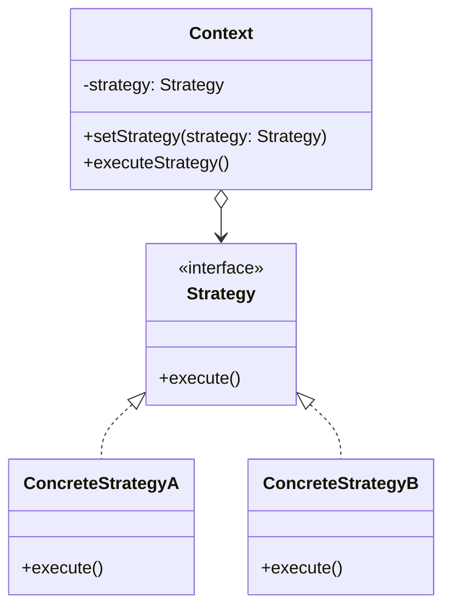

# Strategy Design Pattern

The **Strategy** pattern is a behavioral design pattern that lets you define a family of algorithms, put each of them into a separate class, and make their objects interchangeable.

## 🎯 Purpose

The Strategy pattern suggests that you take a class that does something specific in a lot of different ways and extract all of these algorithms into separate classes called *strategies*. The original class, called the *context*, must have a field for storing a reference to one of the strategies. The context delegates the work to a linked strategy object instead of executing it on its own.

This pattern is highly useful when you have a massive conditional statement (`if` or `switch`) that selects a variant of an algorithm based on some parameters, and you want to be able to switch from one algorithm to another during runtime without modifying the context class.

## 🏗️ Structure and Mechanics

1. **Context**: Maintains a reference to one of the concrete strategies and communicates with this object only via the strategy interface.
2. **Strategy**: The interface common to all concrete strategies. It declares a method the context uses to execute a strategy.
3. **Concrete Strategies**: Implement different variations of an algorithm the context uses.

## 📝 Practice Exercise

In the `problem` package, we have an e-commerce `PaymentService`. It uses a big `if-else` statement to determine which payment method to process (Credit Card, PayPal, Crypto). Whenever a new payment method is added, the `PaymentService` class must be modified, which violates the Open-Closed Principle. The class becomes bloated and difficult to maintain.

### Your task (`refactor` package):
1. **Extract the strategies**: Create an interface (e.g., `PaymentStrategy`) defining the common behavior (e.g., `pay(double amount)`).
2. **Create concrete strategies**: Implement the interface for each payment method (e.g., `CreditCardStrategy`, `PayPalStrategy`, `CryptoStrategy`).
3. **Update the context**: Modify `PaymentService` to accept a `PaymentStrategy` through its constructor or a setter, and delegate the payment processing to the injected strategy.
4. **Client configuration**: In the `OrderApp` client, instantiate the correct strategy and pass it to the context.

By doing this, you'll be able to add new payment methods simply by creating new classes, without modifying the existing `PaymentService` code.

## ✅ Advantages

* You can swap algorithms used inside an object at runtime.
* You can isolate the implementation details of an algorithm from the code that uses it.
* You can replace massive conditionals with polymorphism.
* **Open/Closed Principle:** You can introduce new strategies without having to change the context.

## ❌ Disadvantages

* If you only have a couple of algorithms and they rarely change, there's no real reason to overcomplicate the program with new classes and interfaces that come along with the pattern.
* Clients must be aware of the differences between strategies to be able to select a proper one.
