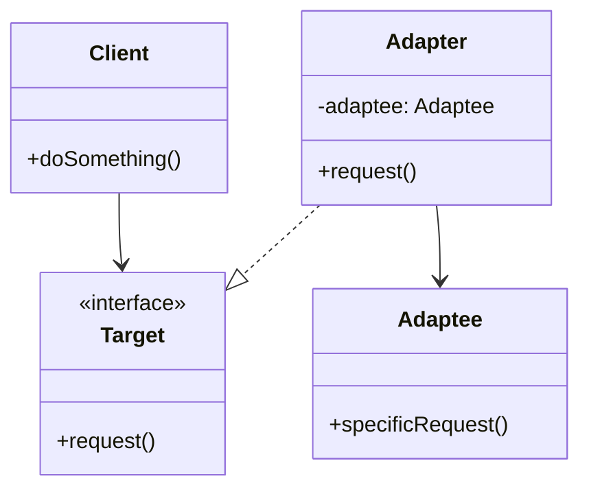

# Adapter Design Pattern

The **Adapter** pattern is a structural design pattern that allows objects with incompatible interfaces to collaborate.

## 🎯 Purpose

Imagine that you're creating a stock market monitoring app. The app downloads the stock data from multiple sources in XML format and then displays nice-looking charts and diagrams for the user. 
At some point, you decide to improve the app by integrating a smart 3rd-party analytics library. But there's a catch: the analytics library only works with data in JSON format.

You could change the library to work with XML. However, this might break existing code that relies on the library, or worse, you might not have access to the library's source code in the first place.

The Adapter acts as a wrapper between two objects. It catches calls for one object and transforms them to format and interface recognizable by the second object.

## 🏗️ Structure and Mechanics

The Adapter pattern uses composition (or inheritance in some languages) to adapt the interface of one class into another interface that the client expects.

1. **Client**: A class that contains the existing business logic of the program.
2. **Target (or Expected Interface)**: An interface that the client code expects to use.
3. **Adaptee**: Some useful class (usually 3rd-party or legacy). The client can't use it directly because it has an incompatible interface.
4. **Adapter**: A class that implements the *Target* interface and wraps the *Adaptee* object.

## 📝 Practice Exercise

In the `com.best.practices.structural.adapter.problem` package, you'll find a `StockMarketApp` that currently downloads XML data using `StockDataProvider`. It wants to pass this data to the `AnalyticsLibrary`, but the library expects a `JsonData` object. 

Currently, the `StockMarketApp` handles the format conversion manually, mixing business logic with low-level data transformation, which is a code smell.

### Your task (`refactor` package):
1. Go to `com.best.practices.structural.adapter.refactor.StockMarketApp`.
2. Create an Adapter class (e.g., `XmlToJsonAdapter`) that extends `JsonData` (or creates a new `JsonData` internally) and takes an `XmlData` object in its constructor.
3. Move the XML to JSON conversion logic inside the Adapter.
4. Use the Adapter in `StockMarketApp` to cleanly pass the data to the `AnalyticsLibrary`, without polluting the business logic.

## ✅ Advantages

* **Single Responsibility Principle:** You can separate the interface or data conversion code from the primary business logic of the program.
* **Open/Closed Principle:** You can introduce new types of adapters into the program without breaking the existing client code, as long as they work with the adapters through the client interface.

## ❌ Disadvantages

* The overall complexity of the code increases because you need to introduce a set of new interfaces and classes. Sometimes it's simpler just to change the service class so that it matches the rest of your code.
