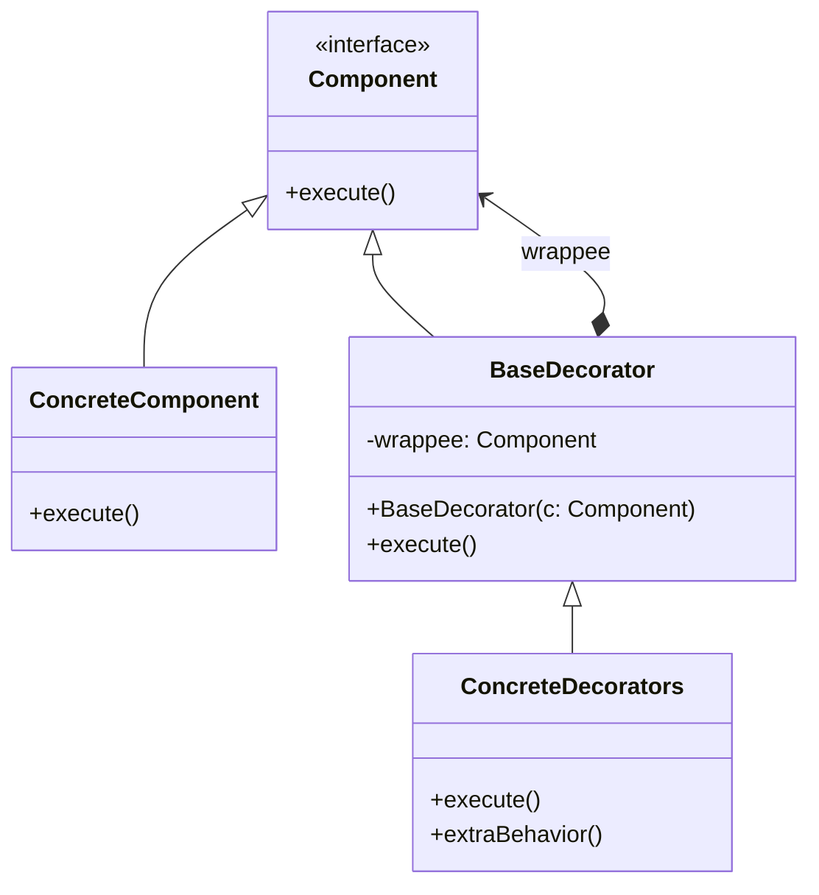

# Decorator Design Pattern

## Intent
**Decorator** is a structural design pattern that lets you attach new behaviors to objects by placing these objects inside special wrapper objects that contain the behaviors.

## Problem
Imagine that you're working on a notification library which lets other programs notify their users about important events. The initial version of the library was based on the `Notifier` class that had only a few fields, a constructor and a single `send` method. The method could accept a message argument from a client and send the message to a list of emails.

At some point, you realize that users of the library expect more than just email notifications. Many of them would like to receive an SMS about critical issues. Others would like to be notified on Slack.

So you extend the `Notifier` class and put the additional notification methods into new subclasses. Now the client was supposed to instantiate the desired notification class and use it for all further notifications.

But what if someone wants to receive notifications on *several* channels at once? You'd have to create special subclasses which combine several notification methods within one class (e.g. `SMSAndSlackNotifier`). This approach quickly leads to an immense number of subclasses that hide the actual code inside. 

## Solution
Extending a class is the first thing that comes to mind when you need to alter an object's behavior. However, inheritance has several serious caveats:
* Inheritance is static. You can't alter the behavior of an existing object at runtime. You can only replace the whole object with another one created from a different subclass.
* Subclasses can have just one parent class. In most languages, inheritance doesn't let a class inherit behaviors of multiple classes at the same time.

One of the ways to overcome these caveats is by using *Aggregation* or *Composition* instead of *Inheritance*. Both of the alternatives work almost the same way: one object *has a* reference to another and delegates it some work, whereas with inheritance, the object itself *is* able to do that work, inheriting the behavior from its superclass.

With this new approach you can easily substitute the linked "helper" object with another, changing the behavior of the container at runtime. An object can use the behavior of various classes, having references to multiple objects and delegating them all kinds of work. 

A wrapper is an object that can be linked with some target object. The wrapper contains the same set of methods as the target and delegates to it all requests it receives. However, the wrapper may alter the result by doing something either before or after it passes the request to the target.

## Structure

## Applicability
* Use the Decorator pattern when you need to be able to assign extra behaviors to objects at runtime without breaking the code that uses these objects.
* Use the pattern when it's awkward or not possible to extend an object's behavior using inheritance.

## Pros and Cons
**Pros**
* You can extend an object's behavior without making a new subclass.
* You can add or remove responsibilities from an object at runtime.
* You can combine several behaviors by wrapping an object into multiple decorators.
* Single Responsibility Principle. You can divide a monolithic class that implements many possible variants of behavior into several smaller classes.

**Cons**
* It's hard to remove a specific wrapper from the wrappers stack.
* It's hard to implement a decorator in such a way that its behavior doesn't depend on the order in the decorators stack.
* The initial configuration code of layers might look pretty ugly.
