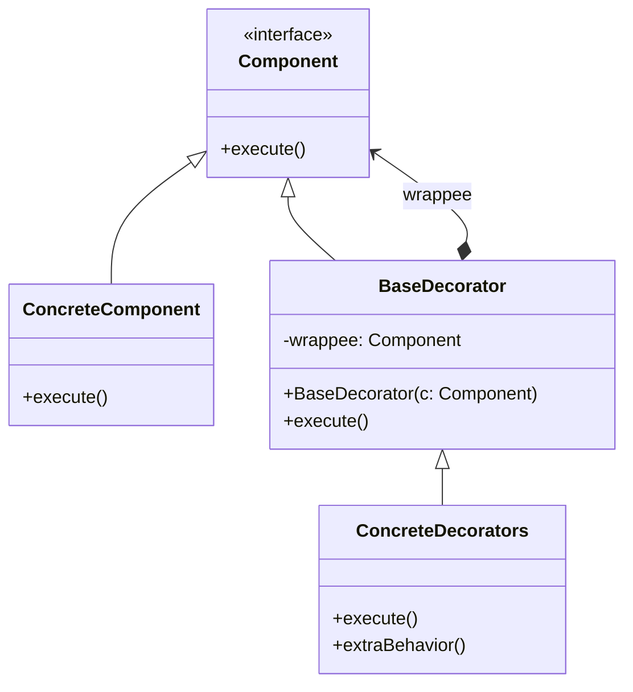

# Decorator Design Pattern

The **Decorator** is a structural design pattern that lets you attach new behaviors to objects by placing these objects inside special wrapper objects that contain the behaviors.

## 🎯 Purpose

Imagine that you're working on a notification library which lets other programs notify their users about important events. The initial version of the library was based on the `Notifier` class that had only a few fields, a constructor and a single `send` method. The method could accept a message argument from a client and send the message to a list of emails.

At some point, you realize that users of the library expect more than just email notifications. Many of them would like to receive an SMS about critical issues. Others would like to be notified on Slack.

Extending a class is the first thing that comes to mind when you need to alter an object's behavior. However, inheritance is static and you can't alter the behavior of an existing object at runtime. Furthermore, what if someone wants to receive notifications on *several* channels at once? You'd have to create special subclasses which combine several notification methods within one class (e.g. `SMSAndSlackNotifier`). This approach quickly leads to an immense number of subclasses.

The Decorator pattern suggests using *Composition* instead of *Inheritance*. A wrapper is an object that can be linked with some target object. The wrapper contains the same set of methods as the target and delegates to it all requests it receives, but it may alter the result by doing something either before or after it passes the request to the target.

## 🏗️ Structure and Mechanics

1. **Component**: Declares the common interface for both wrappers and wrapped objects.
2. **Concrete Component**: A class of objects being wrapped. It defines the basic behavior, which can be altered by decorators.
3. **Base Decorator**: A class that has a field for referencing a wrapped object.
4. **Concrete Decorators**: Define extra behaviors that can be added to components dynamically.

## 📝 Practice Exercise

In the `problem` package, you'll find a notification system that uses subclasses (`SMSNotifier`, `SlackNotifier`, etc.) to send messages.

### Your task (`refactor` package):
1. **Extract Component**: Create a `Notifier` interface with a `send(String message)` method.
2. **Create Concrete Component**: Create a `BasicNotifier` that sends email notifications.
3. **Create Base Decorator**: Create a `NotifierDecorator` that implements `Notifier` and holds a reference to a wrapped `Notifier` object.
4. **Create Concrete Decorators**: Create `SMSDecorator` and `SlackDecorator` extending the base decorator.
5. **Update Client**: Configure your application to stack decorators at runtime to send notifications to multiple channels without subclass explosion.

## ✅ Advantages

* You can extend an object's behavior without making a new subclass.
* You can add or remove responsibilities from an object at runtime.
* You can combine several behaviors by wrapping an object into multiple decorators.
* **Single Responsibility Principle:** You can divide a monolithic class that implements many possible variants of behavior into several smaller classes.

## ❌ Disadvantages

* It's hard to remove a specific wrapper from the wrappers stack.
* It's hard to implement a decorator in such a way that its behavior doesn't depend on the order in the decorators stack.
* The initial configuration code of layers might look pretty ugly.

> [!NOTE]
> **Decorator vs Strategy/Registry (List of Beans)**
> 
> The Notification system is a classic academic example used to demonstrate the Decorator pattern because it perfectly illustrates the problem of "subclass explosion" and how dynamic composition solves it.
> 
> However, in a real-world production environment (e.g., Spring Boot), if you just need to "fire and forget" independent notifications across multiple channels, using a list of beans (similar to a Registry, Strategy, or Observer pattern) is often cleaner and more scalable. 
> 
> **When does Decorator truly shine?**
> Decorator is the superior choice when the wrappers need to **transform data, intercept the flow, or depend on execution order**. For example, if you need to:
> 1. Filter profanity from a message.
> 2. Encrypt the message.
> 3. Compress the message.
> 4. Save it to disk.
> 
> In this case, the output of one step is the input of the next. The `ProfanityFilterDecorator` wraps the `EncryptDecorator`, which wraps the `CompressDecorator`. This layered data transformation is where the Decorator pattern (used heavily in Java's I/O Streams and web server middlewares) is irreplaceable.
